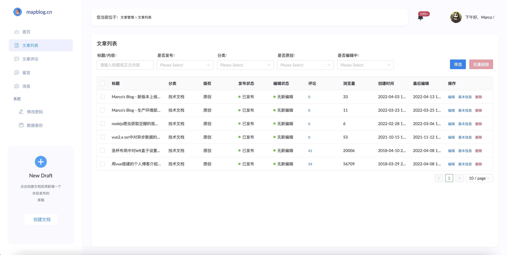
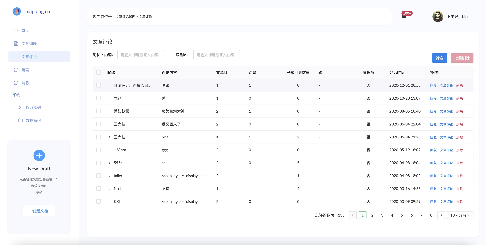
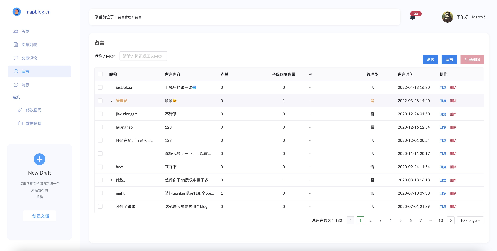
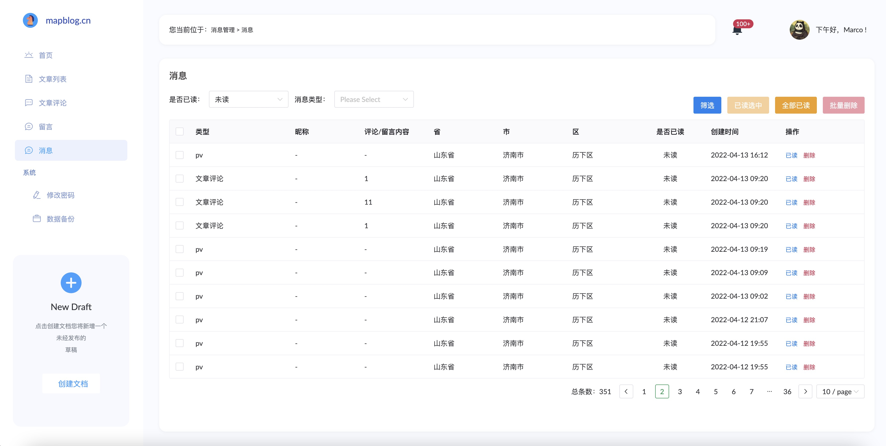
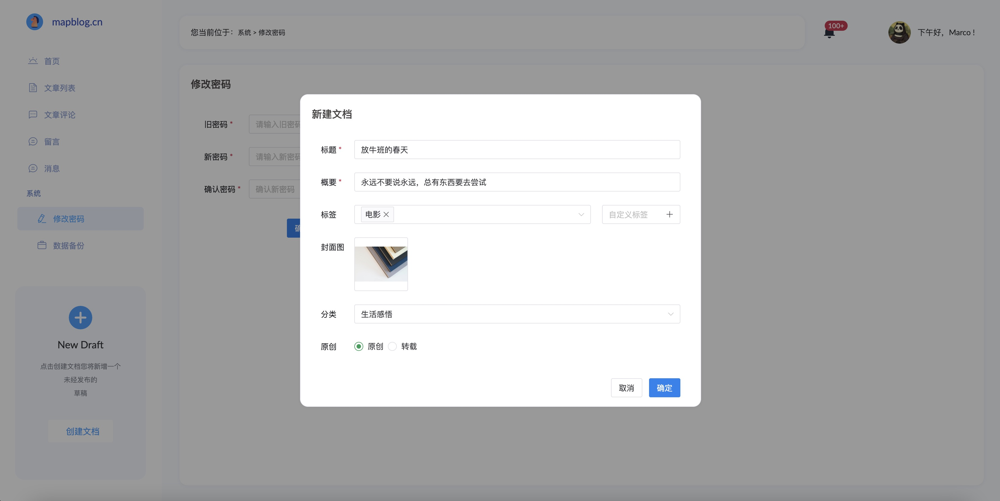
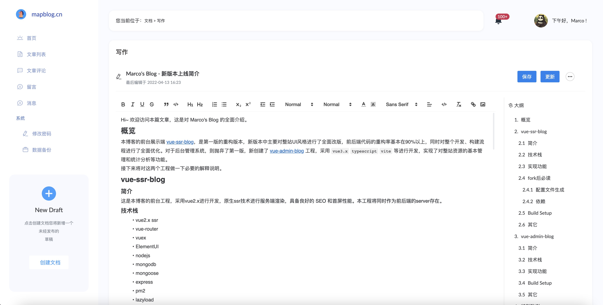
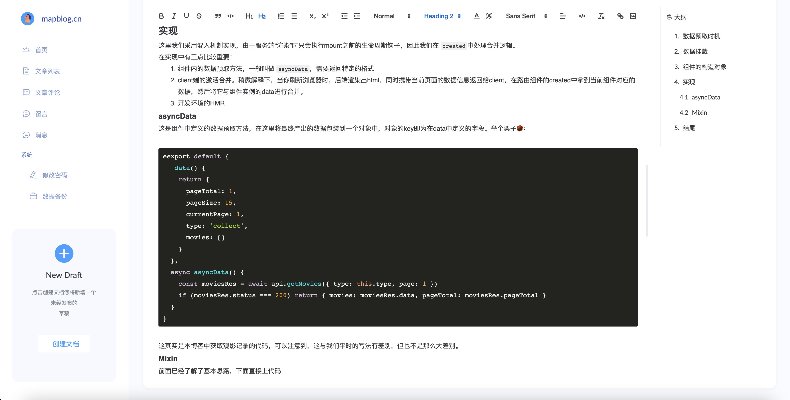

# vue-admin-blog

<center>


</center>


## 介绍
这是 [Marco's Blog](https://mapblog.cn) 的后台管理系统，本项目采用 vue3.x typescript vite 等进行开发，具备完善的类型安全机制，在功能上实现了对全站资源的基本管理和统计分析，与 [vue-ssr-blog](https://github.com/justJokee/vue-ssr-blog) 不同的是，它是一个完全由前端渲染的系统。
## 技术栈
- vue3.x
- vue-router
- vuex
- typescript
- vite
- naive-ui
- quill editor
- nodejs

## 主要功能

- [x] 首页
  - [x] 文章、评论、留言、用户注册统计
  - [x] 访客的浏览器偏好分析
  - [x] 访客操作系统分析
  - [x] 访问量的走势分析
  - [x] 最新留言面板
  - [x] 网站基本概况
- [x] 文章管理
  - [x] 基本信息展示
  - [x] 模糊搜索
  - [x] 基本信息编辑
  - [x] 多条件查询
  - [x] 控制上下线（切换草稿与发布状态）
  - [x] 删除
- [x] 创建文档
  - [x] 保存草稿
  - [x] 发布/更新
  - [x] 支持实时生成目录大纲
  - [x] 文档封面上传七牛云
  - [x] 自动保存
  - [x] 容灾措施，再次进入编辑界面时提示还原未经保存的内容
  - [x] quill 富文本编辑器
    - [x] 支持选择不同语言的代码块
    - [x] 文档内图片上传至七牛云
- [x] 文章评论管理
  - [x] 基本信息展示
  - [x] 模糊搜索
  - [x] 管理员添加评论
  - [x] 管理员回复评论
  - [x] 删除
- [x] 留言管理
  - [x] 基本信息展示
  - [x] 模糊搜索
  - [x] 添加管理员留言
  - [x] 管理员回复留言
  - [x] 删除
- [x] 消息提醒
  - [x] 产生新文章评论时
  - [x] 产生新留言时
  - [x] 产生新的文章pv时
  - [x] 支持设置已读
  - [x] 删除
- [x] 密码管理
- [x] 数据备份
  - [x] 一键备份数据库
  - [x] 备份文件下载
  - [x] 自动备份（留坑，有时间再开发~）
- [x] 博客首页名言管理（留坑，有时间再开发~）
- [x] 豆瓣爬虫的精细化控制（留坑，有时间再开发~）
  - [x] 手动触发
  - [x] 分页起止点

## Build Setup
关于部署至生产环境的详细教程，请查看[这篇文章](https://mapblog.cn/app/article/7)

```bash
# install dependencies
npm install

# serve with hot reload at localhost:6180
npm run dev

# build for production with minification

# 注意，此命令输出生产包至 dist 目录
# 部署时将 dist 下 的所有文件上传至你的静态服务目录中的admin文件夹，例如 /usr/local/nginx/htmls/admin
npm run build

```

## 预览

### 首页

### 文章管理

### 文章评论管理

### 留言管理

### 消息管理

### 创建文档

### 文档编辑器



### 密码管理

### 数据备份


## 其它

1. 本系统对quill编辑器进行了一些魔改，在插入代码块时可选择不同的语言类型，这给前端展示代码块的UI风格提供了多种可能。目前前台展示端使用 `prism` 作为代码高亮插件，它可以自由组合你需要高亮的语言。
2. 文档编辑过程中每5分钟自动保存一次。
3. 文档编辑模块具备容灾措施。当有意外情况发生，文档未经保存而退出时，下一次进入，系统将会提示从本地存储还原未经保存的快照。


最后的最后，如果你喜欢这个项目，不妨star鼓励一下~